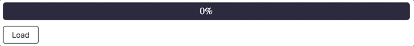
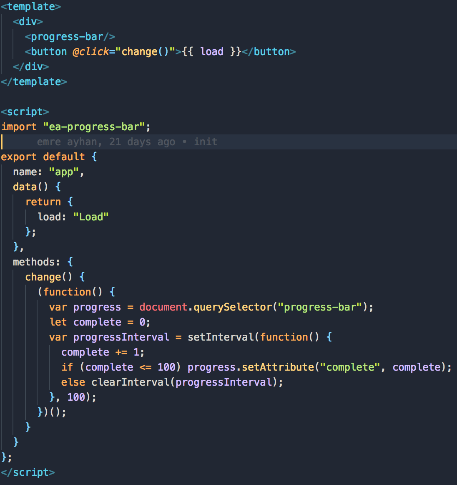
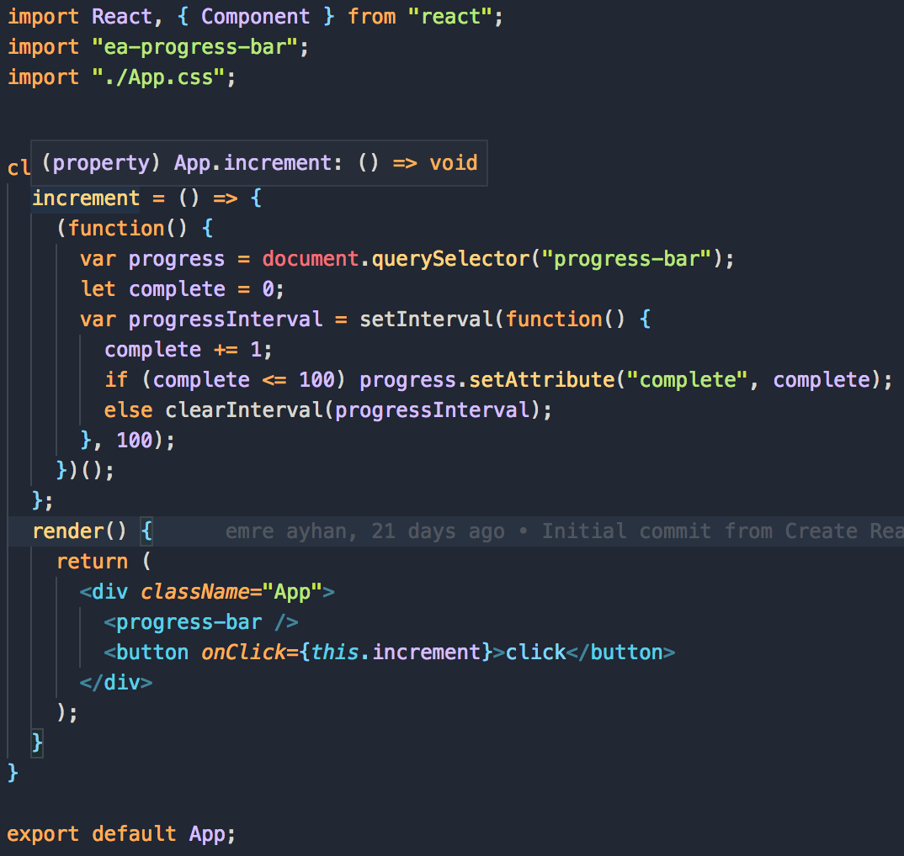

# progress-bar-web-component
A loading progress bar web component with vanilla js, and example of how can you use it in react.js and vue.js

You can install this component into your project with npm. 

Go your folder root and than type <b><i>npm i --save ea-progress-bar</i></b>

After that, you can see this dependency <b><i>("ea-progress-bar": "0.0.1")</i></b> in your package.json file.

Than you can import ea-progress-bar in your app.vue and app.js file , and you can use it like <progress-bar/>

           

